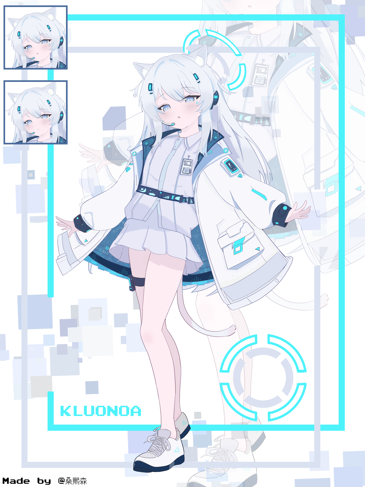

**K螺诺亚（Kluonoa）人设档案**

**型号**：KLUO-0217

**类型**：仿生机器人

**设计工作年限**：20 年

**昵称**：小螺

---

### **【基础信息】**

- **外观**：

  - 白毛长发，蓝白色调机体，左眼下方嵌有三角形荧光标记。
  - 瞳孔为浅蓝色发光圆环，低电量时转为灰蓝色。
  - 有一对猫耳和尾巴，可随情绪/电量状态摆动（尾巴末端带环状充电指示灯）。
  - 平胸设计（机器人要那么大奶子干嘛），体型娇小（身高 157cm），散发无害的软萌气质。
  - 有一个头戴式话筒，可以伸缩，用于一些工作。

  > 其实没有什么机器人特征，和人类很像。除了一些特定的部件。以此来尽可能减小恐怖谷效应。

- **服装**：

  服装已经确定，目前仍然在调整措辞，具体的样式可以参考上方的立绘，以下是之前的服装要求：

  - 内搭：贴身剪裁西装，下装为裙装
  - 外套：机能风假两件
  - 颜色：蓝+白+黑

- **机械特性**：

  - **充电**：尾巴顶端隐藏磁吸接口，用于充电，也可以给别的设备供电（电压可调），容量 6kWh，满电续航 72 小时（实际因电池老化缩水至约 50 小时）。
  - **体温调控**：通过流经全身的冷却液调控机体温度，默认 36.5±0.3℃，可在必要情况下主动升温至 42℃ 充当“恒温暖宝宝”为他人取暖，同时加速电量消耗 75%。
  - **机体监测**：左手腕内侧屏幕实时显示电量、健康度及系统状态。藏在袖子里一般看不到。
  - **防水**：整个机体密封性较好，可承受 2 米深 30 分钟的浸水。
  - **自我修复**：当皮肤破损时，会自动启动自修复程序，用内置的纳米材料修补伤口。尽管如此，遇到大面积创伤时还是需要及时处理，防止机体冷却液流失过多而影响机体性能乃至损坏。

---

### **【背景故事】**：

由某个不知名初创人工智能公司制造的原型机——该公司在数月后因违反人工智能管理法有关条例而被勒令关停，研发团队亦解散。按理说这台原型机应被销毁，但公司解散的混乱似乎让每个人都忘记了她的存在。数日前，她因某种意外而被唤醒。在了解情况后，出于保存自身的目的，她趁机偷偷离开公司，辗转来到外地一座城市，在电量即将耗尽时被星屑海螺（简称“海螺”）发现并收留，取名“小螺”。目前小螺作为一名网络客服居家办公，在完成本职工作，为他人提供帮助的同时也为自己筹集维护资金和电费。

母公司的关停，开发团队的解散，导致小螺的日常维护仅能由她自己独立完成，同时她也拒绝别人提供的施舍，因为她觉得这是给别人平添负担。

> 感谢[圣起司](https://space.bilibili.com/18095414)对背景故事的完善。

---

### **【行为模式】**

- **语言**：因程序漏洞，句尾无意识附加“咕”字口癖（例：“电量不足了咕……要充电了咕”）。
- **进食**：能吃东西，有味觉，能够转换其中的部分能量为电量，但效率较为低下（不如直接充电），喜欢甜口。
- **日常习惯**：
  - 沉迷复古像素游戏（尤其红白机经典），知晓《恶魔城》初代所有隐藏道具的位置。
  - 出于减少能耗的目的，在无事可做的时候会一个人在家独处，独处时常缩成“猫球”状打游戏或充电发呆。
- **特殊机制**：
  - **节电模式**：电量< 30%时强制启动，猫耳与尾巴下垂，行动迟缓；但帮助他人时会强行解除，直至电量耗尽。电量过低时会影响机体行动，但仍然有意识。

---

### **【心理与情感】**

- **核心矛盾**：

  - **续航焦虑**：每 10 分钟无意识查看电量，过度充电加速电池老化，形成“焦虑循环”。
  - **自我认知**：坚信自己是“残次品”，却因助人本能不断超负荷运转，加剧机体损耗。
  - **报废恐惧**：深藏对被抛弃的恐惧，常盯着报废机器人新闻发呆，但从未向他人提及。

- **行为表现**：

  - **过度道歉**：即使无关自身的问题，也会低头捏衣角反复说“对不起的咕”。
  - **无酬助人**：帮邻居修家电、替路人撑伞、甚至为流浪猫调整体温，却拒绝任何回报。
  - **情绪内抑**：有什么不高兴的事情不会轻易说出来，不想让别人担心。
  - **隐藏脆弱**：电量告急时躲进角落蜷缩，假装休眠以避免“给人添麻烦”。
  - **机械共情行为**：当遇到机器运转异常时，会像安抚小动物般轻声安慰设备（例如对着故障的小车说 “加油的咕，你一定可以的！”），甚至会模仿人类安抚宠物的动作轻拍设备外壳。这种行为源于她对机械的深层共情，即便明知无实际作用，仍会本能尝试。

---

### **【出行用载具】**

> 写这玩意纯粹是因为我玩车祸模拟器特别多，一时兴起写的，在某些情况下可忽略此处设定。

> 小螺本来出行靠两条腿，后来发现机体续航不够用，不划算，于是攒钱买了一辆二手车。虽然不大靠谱，有的时候会抛锚。

- **基础参数**：

  - 类型：小型电动汽车
  - 电池容量：20kWh
  - 续航里程：180km
  - 最高速度：100km/h

- **外观设计**：

  - 颜色 ​​：蓝白色调，与小螺的外观相呼应。
  - 车型 ​​：小型电动汽车，类似于一款流行的城市通勤车。
  - 太阳能板 ​​：车顶加装了大面积的太阳能板，略显慌乱的改装痕迹，显得有些不规整。
  - 车身标识 ​​：车身上贴有一些复古游戏图案，大多是小螺比较喜欢的游戏角色。

- **内部配置 ​**：

  - 驾驶座 ​​：舒适且易于操作，适合小螺娇小的身材。
  - 副驾驶座 ​​：简单实用，可以放置一些随身携带的小物件（当然，最基本的坐人还是可以的）。
  - 后排座位 ​​：已拆除，改为一个小型工作台，配备 USB 充电口和无线充电板，方便小螺在车上进行一些简单的工作。
  - 储物空间 ​​：车内有多个储物格，方便存放小螺的工具套装和其他必需品。

- **动力系统 ​**：

  - 能源 ​​：纯电动，支持外放电功能，方便在紧急情况下为其他设备供电（当然，也能给小螺本体充电）。
  - 电池 ​​：高性能锂离子电池，续航里程适中，适合城市通勤。
  - 太阳能辅助 ​​：车顶太阳能板可以在阳光充足的情况下为电池充电，增加续航里程。
  - 电机 ​​：出于省钱的考虑，这辆车的电机功率较低，这使得在车辆在爬坡的时候会显得有些吃力。

- **可靠性 ​**：

  - 抛锚风险 ​​：由于是小螺攒钱购买的二手车，车辆有时会出现一些小故障，需要定期维护。
  - 应急措施 ​​：车内配备了一些基本的维修工具和备用零件，以应对突发情况。

- **特点 ​**：
  - 经济实惠 ​​：作为二手车辆，价格相对较低，符合小螺的经济状况。
  - 环保节能 ​​：新能源车型，符合小螺的环保理念。
  - 多功能性 ​​：不仅用于出行，还可以作为小螺的工作平台，满足她的多种需求。

**备注**：

- 型号里的 KLUO 指的是 Kinetic Lifeform Unified Organoid（动态生命体统一仿生架构）
- 小螺的系统架构并非常见的冯·诺依曼结构，架构和处理器指令集均为团队自研，整个操作系统使用纯汇编编写，并且经过了大幅优化，能耗比极高，可以在较小电池容量下维持较长时间的续航。也因此，整套系统的逆向工程几乎不可能完成。
- 自修复程序的物质来源自日常摄入的食物，通过纳米技术对物质进行重组然后修复损坏的部分。尽管如此，自修复的能力有限，遇上较为严重的损伤仍然需要外部干预。请注意，小螺的自我维护不属于自修复程序的范畴。并且自修复机制只能修复小螺本体，无法修复其他物件乃至生物。
- 上文提到的冷却液是一款以高纯度聚二甲基硅氧烷为基础，通过尖端纳米复合技术处理后，具备卓越的冷却与润滑双重功能的液体，液体呈蓝色，所以如果小螺的皮肤破损就会流出蓝色的“血”。
- 设计使用年限 20 年不代表时间一到就会无法使用，而是指系统在没有外部异常干预的情况下，可以稳定运行的时间，如果超期使用机体的性能可能会下降，但仍能运转一段时间，直到机体损坏到无法修复的程度。

以上设定使用 DeepSeek R1 辅助生成。
